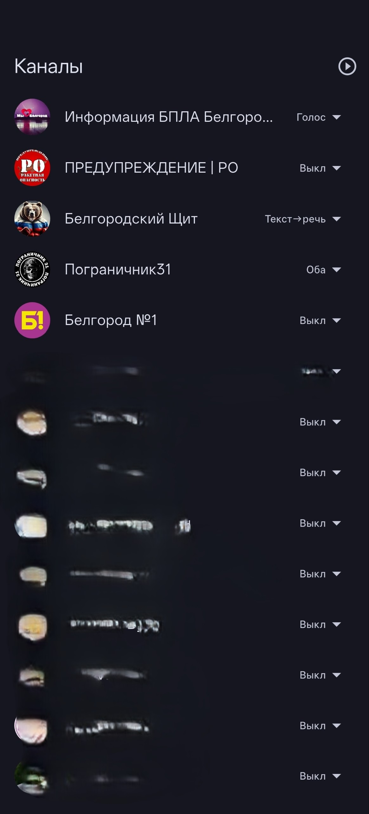
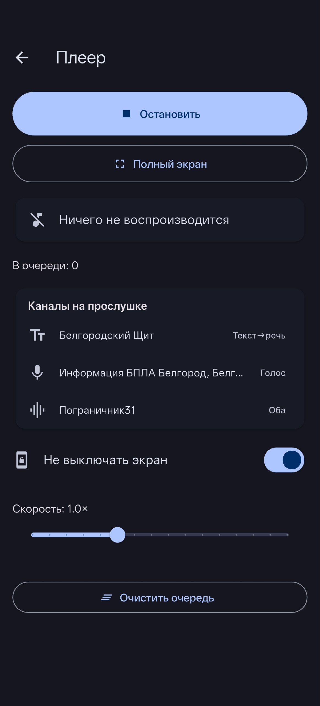

# MaxReader — озвучка каналов MAX

**MaxReader** проговаривает вслух новые сообщения из выбранных вами каналов
мессенджера **MAX**: голосовые сообщения проигрываются как есть, а текстовые —
читаются синтезатором речи **полностью офлайн** (без интернета для озвучки).

Полезно, когда важно слышать сообщения, не глядя в экран — например, следить за
каналами оповещений за рулём. Есть крупный полноэкранный режим: если синтез
проглотил название населённого пункта — можно быстро глянуть и прочитать.

> ⚠️ Неофициальное приложение. Это **урезанный форк** клиента
> [Komet](https://github.com/KometTeam/Komet). Не связано с MAX или VK.

---

## Установка

1. Скачайте APK и установите (нужно разрешить установку из неизвестных
   источников).
2. Ставится **отдельным приложением** — не конфликтует с официальным MAX.

## Первый вход

Вход как в MAX: номер телефона → код из СМS/приложения. Данные хранятся только на
вашем устройстве.

## Выбор каналов

На экране **«Каналы»** — список ваших каналов. Для каждого выберите режим:

- **Выкл** — не слушать.
- **Голос** — проигрывать голосовые сообщения канала.
- **Текст→речь** — читать текстовые сообщения синтезатором.
- **Оба** — и то, и другое.

## Плеер

- **Начать / Остановить** — включить слежение за каналами.
- **Сейчас играет** — канал, аватар и текст текущего сообщения.
- **В очереди** — сколько сообщений ждут озвучки.
- **Скорость** — темп речи и проигрывания (0.5×–2.0×).
- **Не выключать экран** — держать экран включённым.
- **⛶ Полный экран** — крупный режим для взгляда за рулём.
- **Каналы на прослушке** — что и в каком режиме сейчас слушается.

## Полноэкранный режим (за рулём)

Крупный шрифт, тёмный фон. Новое сообщение появляется **сверху**; старые
постепенно тускнеют и уходят вниз. Экран не гаснет. Выход — тап по экрану,
крестик или «назад».

---

## Частые вопросы

**Нужен ли интернет?** Да — чтобы получать сообщения из MAX. Но **озвучка текста
работает офлайн** (модель речи на устройстве), поэтому TTS не зависит от внешних
сервисов.

**Почему пишет «модель озвучки не установлена»?** Голосовой режим работает без
модели. Для режима «Текст→речь» нужна речевая модель — она поставляется вместе с
приложением и распаковывается при первом запуске.

**Приватность.** Приложение общается только с серверами MAX. Токен и данные
хранятся локально.
