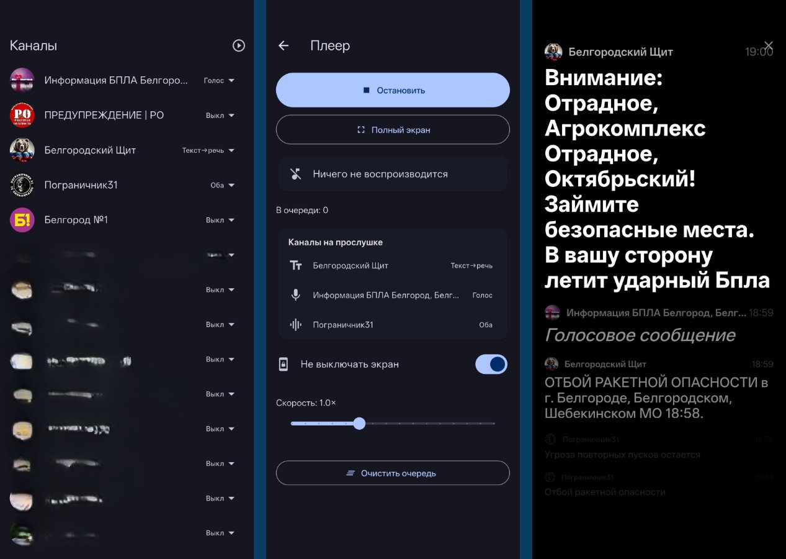

# ДронВестник — озвучка каналов оповещения об угрозах БПЛА

**ДронВестник** (DroneHerald) проговаривает вслух новые сообщения из выбранных
вами каналов мессенджера **MAX**: голосовые сообщения проигрываются как есть, а
текстовые — читаются синтезатором речи **полностью офлайн** (без интернета для
озвучки). Основной сценарий — информационные каналы об угрозах атак дронов и
БПЛА: важно слышать оповещения, не глядя в экран, например за рулём.

Есть крупный полноэкранный режим: если синтез проглотил название населённого
пункта — можно быстро глянуть и прочитать.

> ⚠️ **Это НЕОФИЦИАЛЬНЫЙ клиент.** Приложение никак не связано с MAX, VK или
> их разработчиками, не одобрено ими и не поддерживается ими. Это **урезанный
> форк** open-source клиента [Komet](https://github.com/KometTeam/Komet),
> сделанный для одной узкой задачи — озвучки каналов. Используете на свой
> страх и риск: вход выполняется вашим аккаунтом MAX через неофициальное
> приложение.

---

## Установка

[**⬇ Скачать последний релиз (APK)**](https://github.com/alfeg/voice_streamer/releases/latest)
· [все релизы](https://github.com/alfeg/voice_streamer/releases)

1. Скачайте APK под свою архитектуру (обычно `arm64-v8a`) и установите
   (нужно разрешить установку из неизвестных источников).
2. Ставится **отдельным приложением** — не конфликтует с официальным MAX.

## Исходный код, сборка и безопасность

- **Код полностью открыт** — весь исходник в этом репозитории, форк
  [Komet](https://github.com/KometTeam/Komet) с тонкой «читалкой» поверх
  (обзор архитектуры — в [README-fork.md](README-fork.md)).
- **Каждый релиз собирается публичным CI** — GitHub Actions прямо из тега в
  этом репозитории ([release.yml](.github/workflows/release.yml)). Логи каждой
  сборки открыты: можно проследить путь от исходника до APK — в APK попадает
  ровно то, что лежит в репозитории.
- **Никакой телеметрии и сторонних серверов** — приложение общается только с
  серверами MAX (`api.oneme.ru`). Токен и данные аккаунта хранятся только на
  устройстве. Озвучка текста — офлайн, модель речи работает локально.
- **Не доверяете чужим APK?** Соберите сами: `flutter build apk --release
  --flavor komet` — или устройте собственный форк-релиз, pipeline уже готов.

## Первый вход

Вход как в MAX: номер телефона → код из СМS/приложения. Данные хранятся только на
вашем устройстве.

## Выбор каналов

На экране **«Каналы»** — список ваших каналов. Для каждого выберите режим:

- **Выкл** — не слушать.
- **Голос** — проигрывать голосовые сообщения канала.
- **Текст→речь** — читать текстовые сообщения синтезатором.
- **Оба** — и то, и другое.

## Плеер

- **Начать / Остановить** — включить слежение за каналами.
- **Сейчас играет** — канал, аватар и текст текущего сообщения.
- **В очереди** — сколько сообщений ждут озвучки.
- **Скорость** — темп речи и проигрывания (0.5×–2.0×).
- **Не выключать экран** — держать экран включённым.
- **⛶ Полный экран** — крупный режим для взгляда за рулём.
- **Каналы на прослушке** — что и в каком режиме сейчас слушается.

## Полноэкранный режим (за рулём)

Крупный шрифт, тёмный фон. Новое сообщение появляется **сверху**; старые
постепенно тускнеют и уходят вниз. Экран не гаснет. Выход — тап по экрану,
крестик или «назад».

---

## Частые вопросы

**Нужен ли интернет?** Да — чтобы получать сообщения из MAX. Но **озвучка текста
работает офлайн** (модель речи на устройстве), поэтому TTS не зависит от внешних
сервисов.

**Почему пишет «модель озвучки не установлена»?** Голосовой режим работает без
модели. Для режима «Текст→речь» нужна речевая модель — она поставляется вместе с
приложением и распаковывается при первом запуске.

**Приватность.** Приложение общается только с серверами MAX. Токен и данные
хранятся локально.

---

